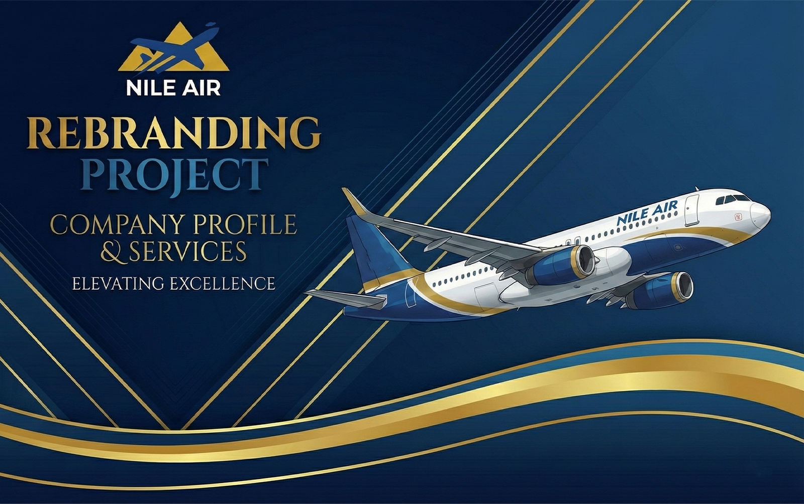

  

<h1 align="center"> ✈️ Nile Air – Wings of Comfort</h1>

This project aims to create a **comprehensive advertising campaign** and a **new visual identity** for Nile Air.  

---

## 👥 Team Members
- Ahmed Bassem Wagih Ragab Elkholy  
- Ahmed Mohamed Gaber Hafez  
- Adham Hesham Mostafa Abdelkhallek  
- Omr Ryad Bakry Abdellghani  
- Ahmed Mohamed Ahmed Mahmoud  
- Abdullah Ahmed Sayed

---

## 📌 Project Description
This project aims to create a comprehensive advertising campaign and a new visual identity for Nile Air.
The campaign focuses on refreshing the company’s brand image and positioning it as a modern, comfortable, and reliable airline for both local and international travelers.

---

## 🎯 Objectives of the Campaign
- Enhance brand awareness and strengthen Nile Air’s presence in the market.  
- Increase bookings through the official website and mobile application.  
- Improve brand perception, positioning Nile Air as the airline of **comfort, safety, and reliability**.

---

## 🔎 Scope of work

The scope includes:
- **Logo Redesign**: A modern logo reflecting Nile Air’s values and vision.  
- **Social Media Posters**: Engaging visuals tailored for different digital platforms.  
- **Billboards & Outdoor Posters**: Large-scale designs to increase brand visibility.  
- **Flyers & Roll-ups**: Promotional materials for exhibitions, airports, and events.  
- **Aircraft Exterior Design**: A creative livery showcasing the new identity.  
- **Onboard Packaging**: Branded meal boxes, kits, and other in-flight essentials.   
- **Ticket Design**: A fresh, modern look for boarding passes and tickets.   
- **Business Card Design**: Professional business cards for staff and management.  
 
---

## 🗓 Project Timeline

| Week | Phase | Details |
|------|--------------------------|-------------------------------------------------------------------------|
| 1 | Research & Planning | Market analysis – Defining target audience |
| 2 | Creative Messaging | Copywriting – Visual identity design |
| 3–5 | Production | Designing visuals & banners – Preparing landing page|
| 6 | Review & Refinement | Review all designs – Refine based on feedback – Adjust colors & layouts|
| 7 | Final Testing & Docs | Test designs on mockups – Ensure compatibility – Prepare guidelines doc|
| 8 | Presentation & Delivery | Final presentation – Professional slides – Deliver all final files |

---

## 📂 Deliverables
- Full set of branding materials (logo, posters, billboards, tickets, etc.)  
- Refined and tested designs ready for deployment.  
- Comprehensive **Brand Guidelines Document**.  
- Final professional presentation & source files.

---

## 📝 Project plan

| Member | work |
|------------------------|---------------------------------------------------------------|
| Ahmed Bassem | colors and font choosing - Flyers & Roll-ups design - presentation |
| Adham Hesham | Logo design - Ticket design |
| Abdullah Ahmed | packaging and gifts design - Airplane design - business card design  |
| Omr Ryad | Billboards & Outdoor Posters designs - Brochures - company profil |
| Ahmed Gaber | Letterhead - Logo design - Ticket design |
| Ahmed Mahmoud | Ticket & Business Card Design - Social media designs |

---

##  📖 presentation link
https://drive.google.com/drive/folders/1KnqPBcQ1pTFIPQ5ahCuf-8gna4R3e5VB

---

## 🗂️ Drive link
https://drive.google.com/drive/folders/1szUn7AeUi9lxUorbAy3WGp4Yi_9QNft7  
